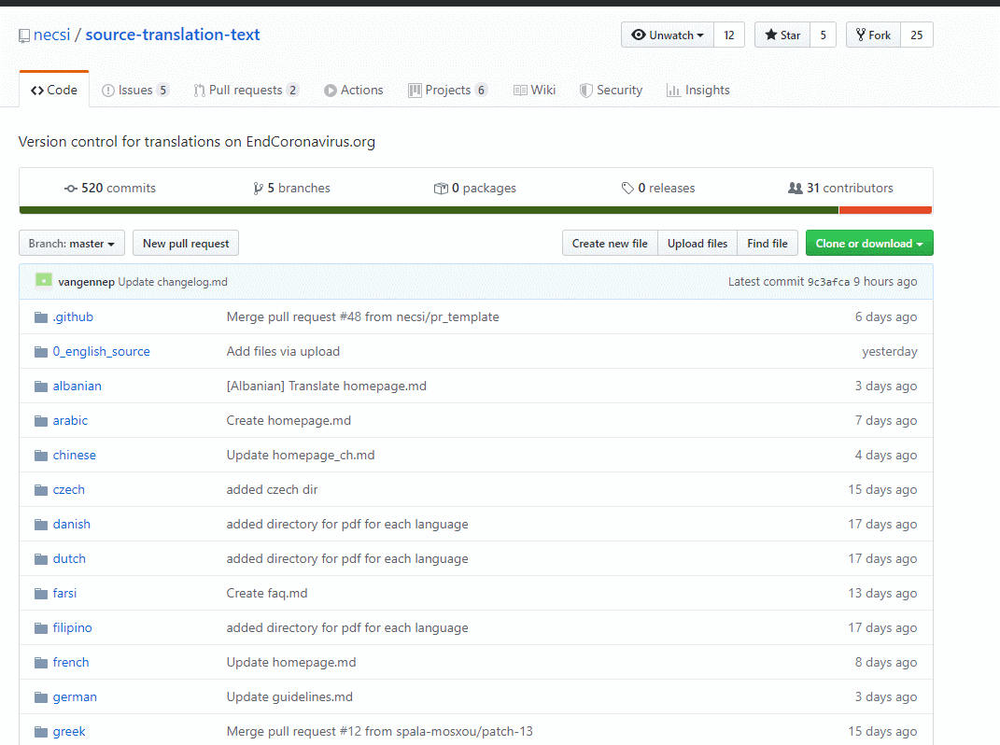
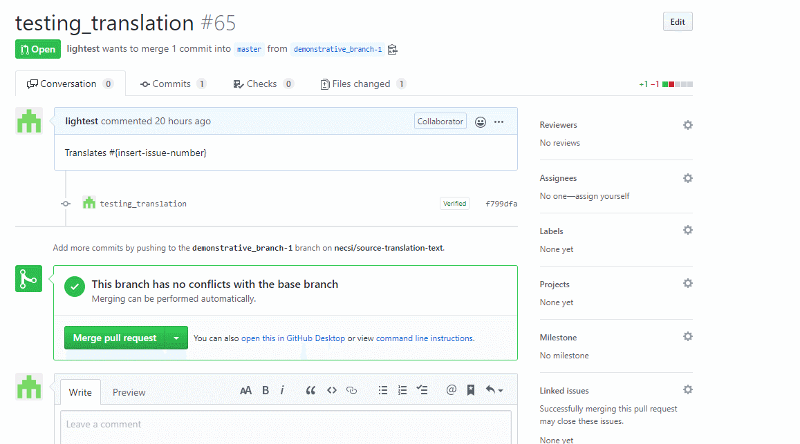
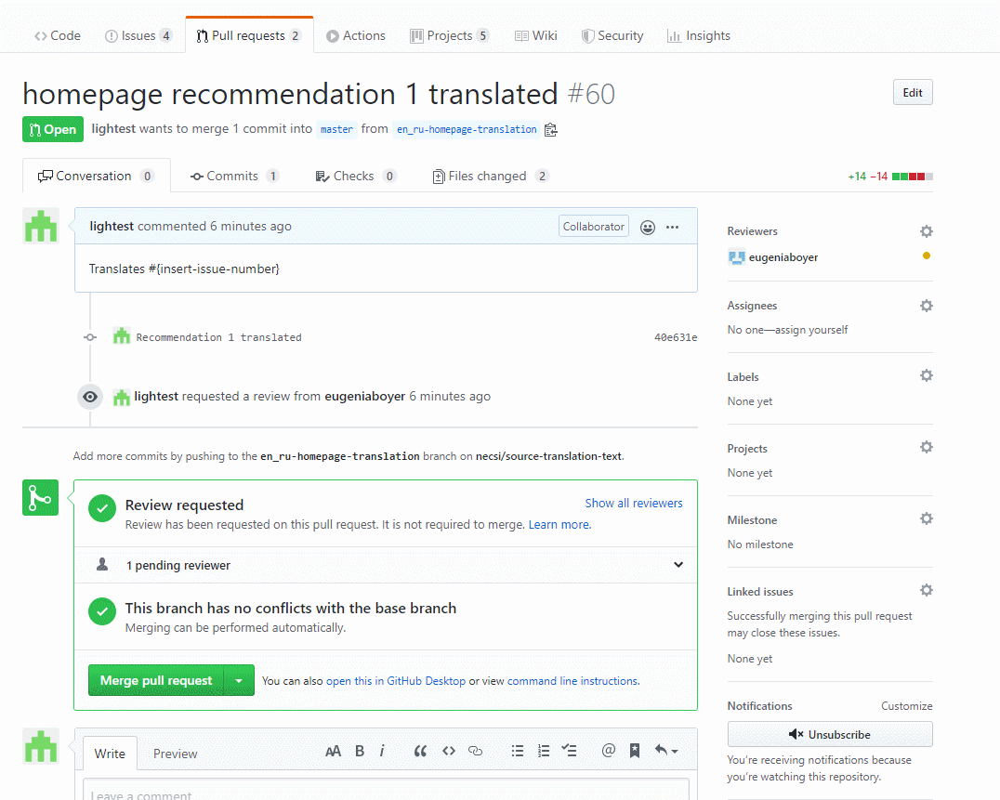

# Source translated text for endcoronavirus.org

(for web v2)

## Useful info to get started

We use plain text (markdown), one can paste own trasnlation from any source.

- [Markdown Reference](https://guides.github.com/features/mastering-markdown/)

Each language has a directory

Files can be

1.  added, edited in place via web browser or via git
2.  GUI or
3.  command line.

The easiest option is (1.). Once a file is edited, the commit message (just below the editing window) can include both language and changelog
The [changelog](changelog.md) is maintained also separately in the root directory of the repo

Editors are used as collaborators. Each editor works **only** on his/her own directory, not touching the rest (otherwise we need a more complex procedure, which we don't want now

## Workflow

- once collaborator (talk to [Paul](paulghaddad) or [Angelo](aprossi) look for your language directory.
- edit the files from the web interface and put the content
- publish your changes using Pull Request (PR in short). Add meaningful commit messages and a branch name. If you commit half-way before ending a changelog entry, state it in the commit message (e.g. `started working on new About page`)
- once one of the formal changes is applied to your language, please document it (e.g. `changelog 20 Italian`)

Here's an example using russian language:

### Adding reviewers

If you're working in a team of people and want your changes to be reviewed, invite them to do so in your Pull Request:

### Conducting reviews

If you were invited to review changes yourself, here's how to conduct it:

## Translations

Access to the translation directory and the translator are provided below:

- Original ([English](0_english_source)) - TBA - https://www.endcoronavirus.org/ (v2)

- Arabic - TBA - [v1](https://ar.endcoronavirus.org)
- Chinese - TBA -
- Czech - TBA - https://cs.endcoronavirus.org (v1)
- Dutch - TBA - https://nl.endcoronavirus.org (v1)
- Farsi - TBA -
- Filipino - TBA -
- French - TBA - https://fr.endcoronavirus.org (v1)
- German - TBA - https://de.endcoronavirus.org (v1)
- Greek - TBA -
- [Hebrew](hebrew) - TBA - https://he.endcoronavirus.org
- Hindi - TBA -
- Hungarian - TBA -
- Indonesian - TBA -
- [Italian](italian) - TBA - [v1](https://it.endcoronavirus.org) - [v2](https://www.endcoronavirus.org/home/italian)
- Japanese - TBA -
- Kannada - TBA -
- Korean - TBA -
- Nigerian pidgin - TBA -
- Polish - TBA -
- Portugues (Brazil) - TBA -
- Portugues (Portugal) - TBA - https://pt.endcoronavirus.org/ (v1)
- Romanian - TBA -
- Russian - TBA - https://ru.endcoronavirus.org/ (v1)
- Spanish - TBA - https://es.endcoronavirus.org/ (v1)
- Swedish - TBA -
- Thai - TBA -
- Turkish - TBA -
- Urdu - TBA -
