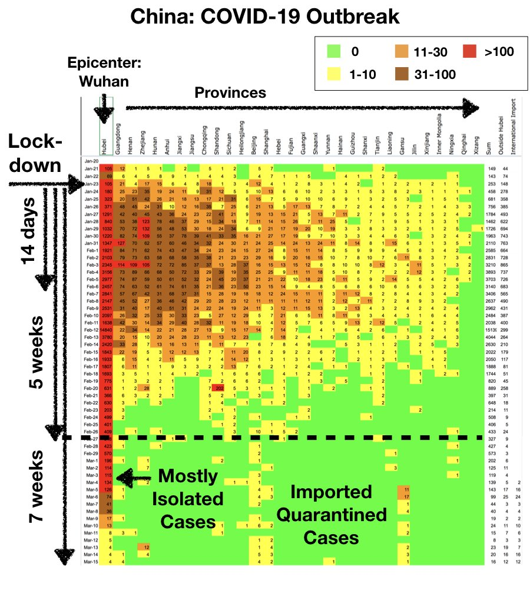

# Aiuta a diffondere informazioni, non virus

### L'obiettivo del nostro lavoro è fornire informazioni rilevanti che risultino in azioni pragmatiche per i singoli individui, le aziende, in governi e le ONG.

_Sono un fisico con esperienza al MIT e uno studioso della complessità che si occupa di pandemie. Ho avvisato del rischio di pandemie globali legate all’aumento degli spostamenti di persone per 15 anni. Ho raccomandato il controllo di sintomi nelle comunità per fermare l'**Ebola** in Africa Occidentale nel 2014, ed ha funzionato._

Unisciti al nostro team di più di 5000 volontari nella lotta contro COVID-19: (LINK TO SIGNUP PAGE)

||
|Prof. Yaneer Bar-Yam, PresidentNECSI|
| --- |

## Il modo più veloce, e anche l'unico, di fermare COVID-19 è un contenimento nazionale di cinque settimane.

### Le nostre 3 principali raccomandazioni ai governi
### Confinamento

In gran parte dell'Europa e del Nord America la crescita esplosiva di COVID-19 significa che **un confinamento rigido di 4-6 settimane è necessario per fermare l'epidemia**. Tali confinamenti/contenimenti possono essere difficili politicamente da implementare e comportano sempre costi sociali ed economici significativi nel breve termine. Ma gli effetto sono sostanziali e la loro durata limitata. Due mesi dopo l'imposizione del contenimento, la Cina ha virtualmente eliminato la trasmissione locale di COVID-19. Wuhan è attualmente un luogo più sicuro di Londra o New York, e l'economia cinese è sulla strada del recupero Senza il confinamento rigoroso della Cina, il danno economico prodotto da COVID-19 sarebbe stato ordini di grandezza maggiore.

Durante un contenimento rigido gli individui restano a casa, a parte uscite per ottenere cibo ed altri beni essenziali, accedere alle cure mediche o condurre lavoro essenziale al funzionamento della società. I governi devono offrire supporto economico e sociale ai cittadini bisognosi.

[Perchè 4-6 settimane?](https://github.com/necsi/source-translation-text/raw/master/italian/pdf/5weeks_it.pdf) Durante le prime due settimane di contenimento, coloro che sono già infetti mostreranno sintomi. Questo periodo di incubazione dura tipicamente 3-5 giorni, ma può durare fino a due settimane. Gli individui infetti guariranno dai casi lievi di COVID-19 o cercheranno supporto sanitario. Le uniche persone che possono essere infettate sono coloro che abitano con un individuo precedentemente infetto. Dal momento che saranno noti gli individui infetti, in base ai sintomi ed ai controlli, possiamo sapere chi può essere infettato ed isolarli, in modo da evitare ulteiori contagi (questo è definito tracciamento dei contatti).

Durante le 3-4 settimane seguenti, ogni nuova persona infetta tra i familiari e tra coloro che vivono assieme ad individui infetti guarirà o cercherà cure mediche. Una volta isolati, non potranno infettare ulteriori individui. Il numero di casi scenderà rapidamente. **Per la fine del confinamento, i casi di COVID-19 saranno una piccola frazione del numero originale.** Questo è esattamente quello che è successo in Cina.

Il confinamento fornisce anche tempo per aumentare in modo sostanziale le scorte di test kit per il COVID-19, e la capacità di produrli. Se il numero di infezioni riduce di molto usando il confinamento e cominciano i controlli di massa, COVID-19 può essere controllato dopo 5 settimane senza dover ricorrere a misure estreme di distanziamento sociale. Isolare gli individui malati e i loro contatti più prossimi sarà sufficiente. Questo è quanto è stato fatto per controllare l'epidemia per i pochi casi registrati a Singapore.

Il caso dell'Italia può servire da avvertimento per chi volesse tentare un confinamento "soft". Le misure di confinamento in Italia sono state non sufficientemente rigide. Alcuni  hanno aggirato le restrizioni di movimento e hanno continuato a diffondere COVID-19. La malattia ha continuato a crescere esponenzialmente. L'italia sta irrigindendo le sue procedure di confinamento per prevenire ulteriore diffusione. La Danimarca, che ha implementato un confinamento più completo e chiuso i propri confini, ha avuto maggiore successo nella limitazione dell'epidemia.

    * Leggi il meme by Chen Shen and Yaneer Bar-Yam: [Why A 5-Week Lockdown Can Stop COVID-19](LINK)

### Controlli di massa, tracciamento dei contatti, isolamento

Controlli di massa per COVID-19 combinati con tracciamento ed isolamento dei contatti delle persone infette è l'intervento che causa il minor impatto negativo sull'economia, salvando comunque molte vite. Singapore e Corea del Sud hanno mostrato che questo approccio può battere COVID-19.

I governi devono utilizzre le seguenti strategie per fermare COVID-19:

1. **Tracciamento dei contatti**: Isolare, monitorare e testare chiunque sia stato in contatto con ogni individuo infetto noto.

2. **Controllo dei sintomi generici**: Testare chiunque nell'area geografica di individui infetti da COVID-19 mostri sintomi, come febbre.

3. **Campionamento mirato**: Condurre test casuali su individui all'interno di popolazioni ad alto rischio, come prigioni, case di riposo, dormitori studenteschi.

I paesi, specie in Asia, che hanno l'esperienza necessaria, devono aiutare il resto del mondo per entrare a regime con queste misure. I team di tracciamento dei contatti devono essere istruiti e i paesi devono rapidamente aumentare la capacita' di test. I paesi devono usare la capacità di test nelle istituzioni accademiche (università, centri di ricerca) e nelle aziende.

### Restrizione della mobilità permettendo le forniture essenziali e la risposta sanitaria

**I viaggi dalle aree sede di epidemia devono essere bloccati**. Ogni individuo deve andare incontro a 14 giorni di quarantena se arriva dalle aree affette. Laddove esistono episodi di epidemia, limitare la mobilità all'essenziale permette alle aree con minor numero di casi di prendere il controllo delle proprie epidemie più velocemente e con una quantità limitata di interventi. La possibilità di tornare alla normalità più velocemente è importante per il recupero economico e per poter fornire aiuto alle aree più duramente colpite.

||
| --- |

## [Linee guida per la famiglia](https://github.com/necsi/source-translation-text/blob/master/0_english_source/pdf/family_en.pdf)
## [Linee guide per la comunità](https://github.com/necsi/source-translation-text/blob/master/0_english_source/pdf/individual_community_government_en.pdf)
## [Linee guida per gli stati e le amministrazioni](https://github.com/necsi/source-translation-text/blob/master/0_english_source/pdf/individual_community_government_en.pdf)
